# 🧠 LabSense AI

## 📱 About the App

**LabSense AI** is an intelligent medical analysis Flutter application that allows users to upload and analyze lab reports using AI.

The app uses advanced AI (Gemini API) to extract insights from blood tests, generate health scores, detect abnormalities, and provide personalized medical advice.

It also includes authentication, history tracking, profile management, and multilingual support.

---

## 🎥 Live Demo

Experience LabSense AI in action:

🔗 [Watch the demo video](https://drive.google.com/file/d/1KnIZcuadXn9U_yn9NXeeaKZNlYEsJ6Jm/view?usp=drivesdk)

---

## ✨ Features

- 🧪 AI-powered blood test analysis
- 📊 Health score generation (0–100)
- 🧠 Smart detection of normal & abnormal results
- 💡 Personalized medical advice (nutrition, lifestyle, medical)
- 📁 Save & manage analysis history (Firebase)
- 🔍 Search and filter reports
- 📸 Scan or upload lab reports
- 🔐 Authentication (Email / Google Sign-In)
- 👤 User profile with image upload
- 🌍 Multi-language support (English / Arabic)
- 📈 Health statistics visualization (charts)
- 🎨 Clean, modern UI with smooth animations
- ⚡ State management using GetX

---

## 🧱 Tech Stack

- Flutter 
- GetX (State Management)
- Firebase (Auth + Firestore)
- Gemini AI API 🤖
- Fl Chart 📊
- Image Picker 📷
- Shared Preferences & GetStorage

---

## 📸 Screenshots

### 🔐 Splash Screen

  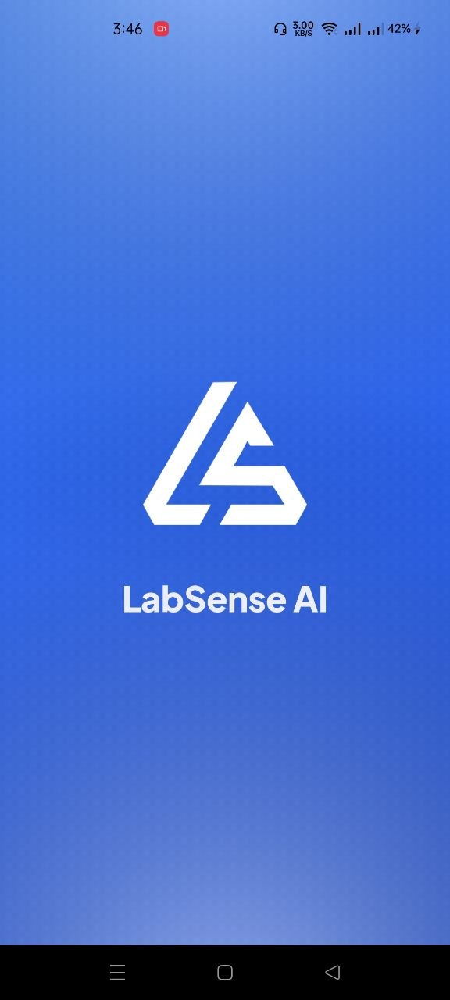

---

### 🔐 OnBoarding Screens

  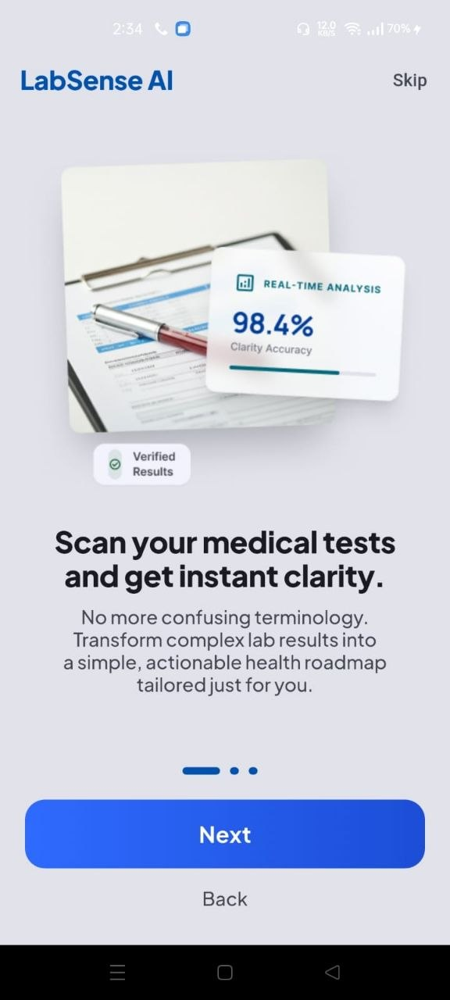
  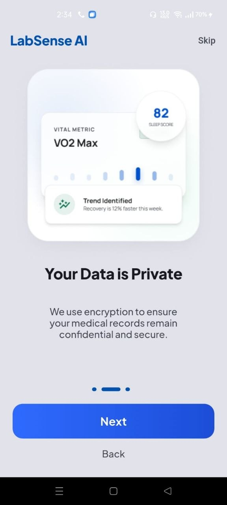
  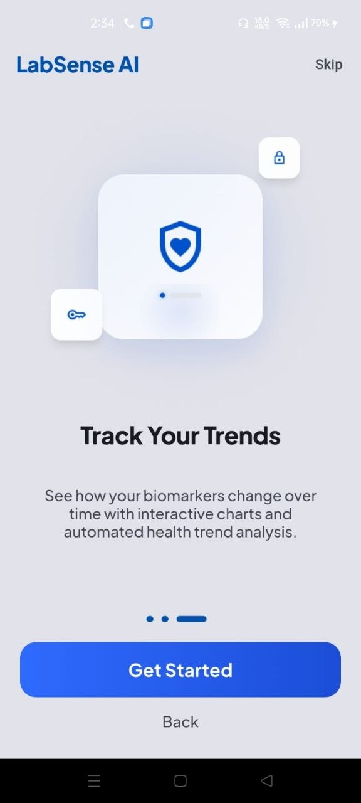

---

### 🔑 Authentication

  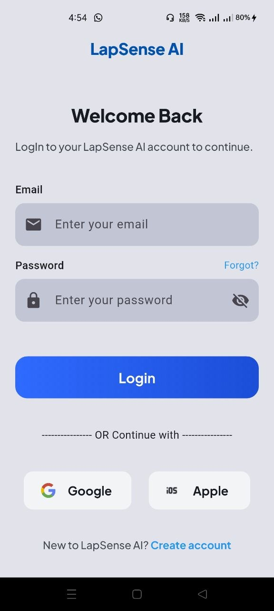
  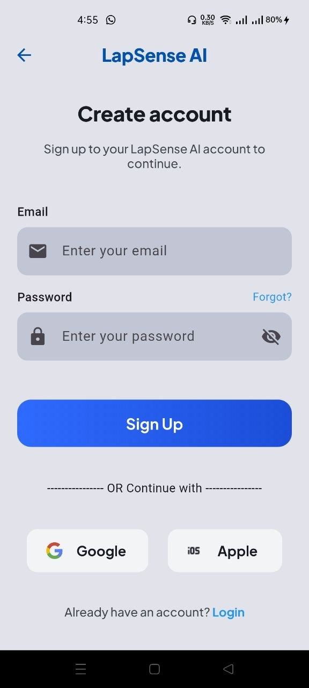
  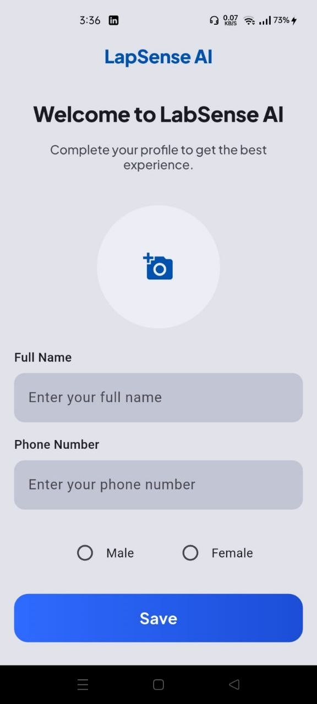

---

### 🏠 Home & Navigation

  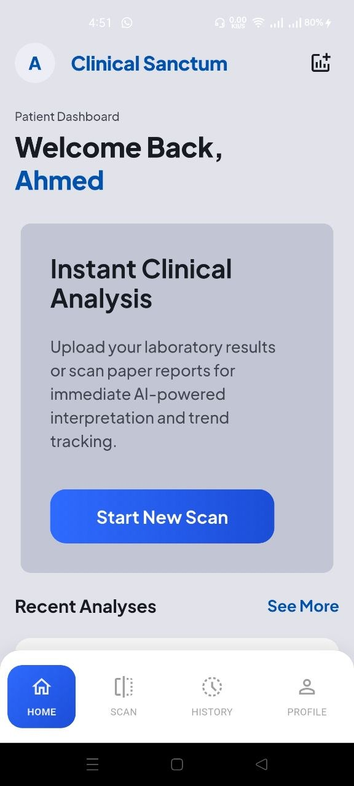
  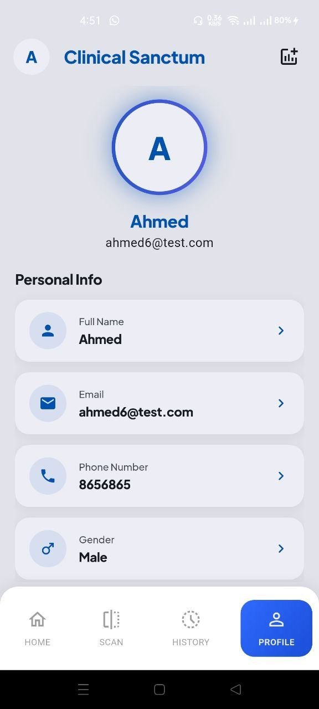
  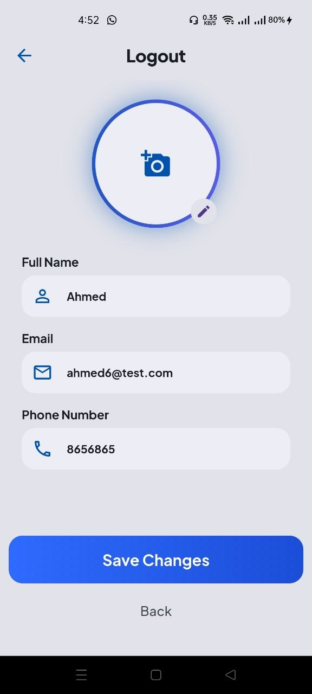

---

### 🧪 Scan & Analysis

  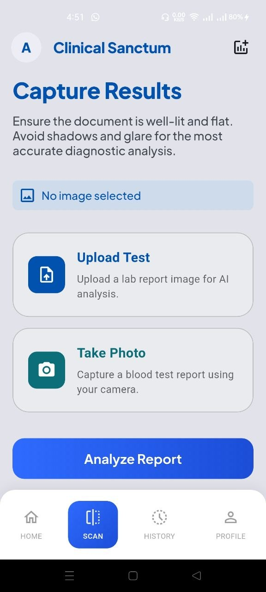
  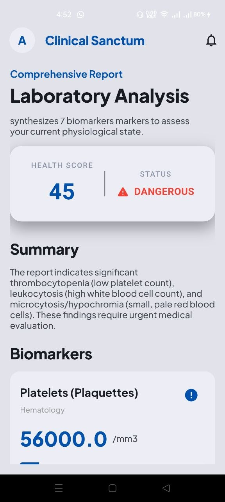
  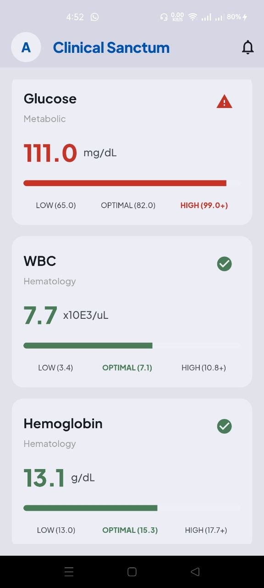
  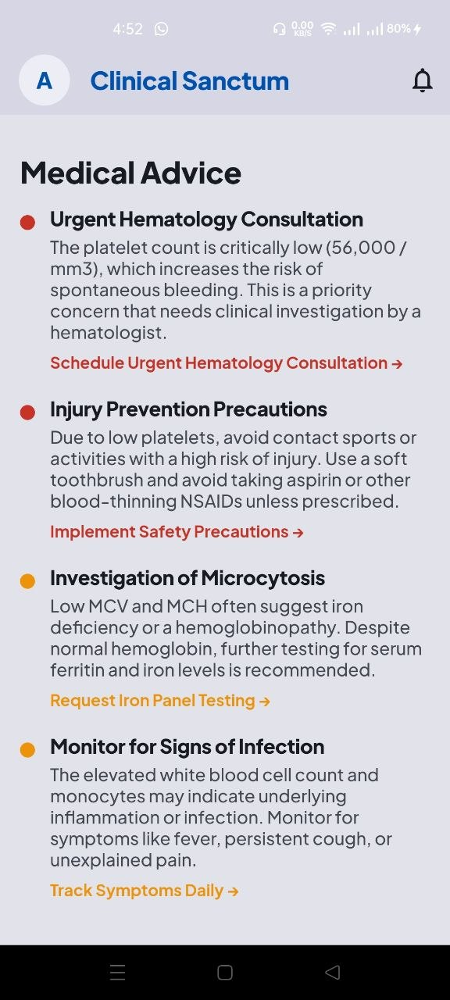
  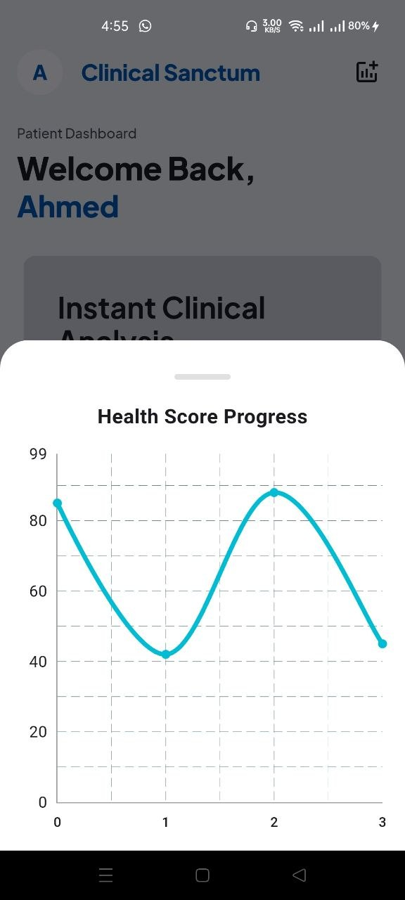

---

### 📊 Reports History

  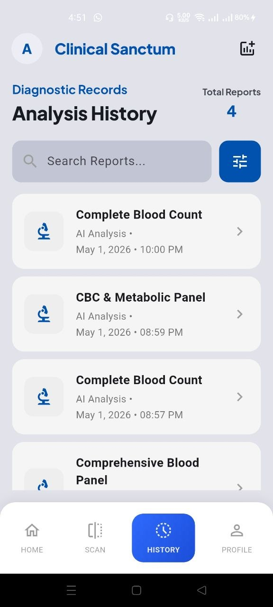

---

## ⚙️ Architecture

The app follows a **clean and scalable structure**:

- Controllers (GetX)
- Models (Data Layer)
- Services (Firebase / AI)
- Views (UI Screens)
- Core (Constants / Functions / Routes)

---

## 👨‍💻 Developer

- **Ahmed Elsayed**
- Flutter Developer 🇪🇬
- GitHub: https://github.com/Ahmed582002

---

## 🚀 Future Improvements

- Voice-based report explanation
- Doctor recommendation system
- PDF export for reports
- Offline AI caching